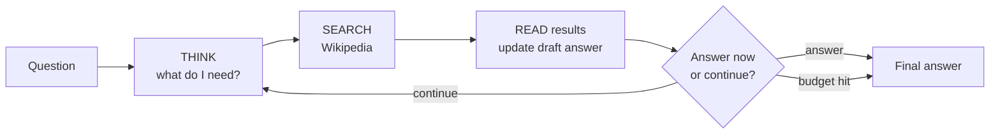
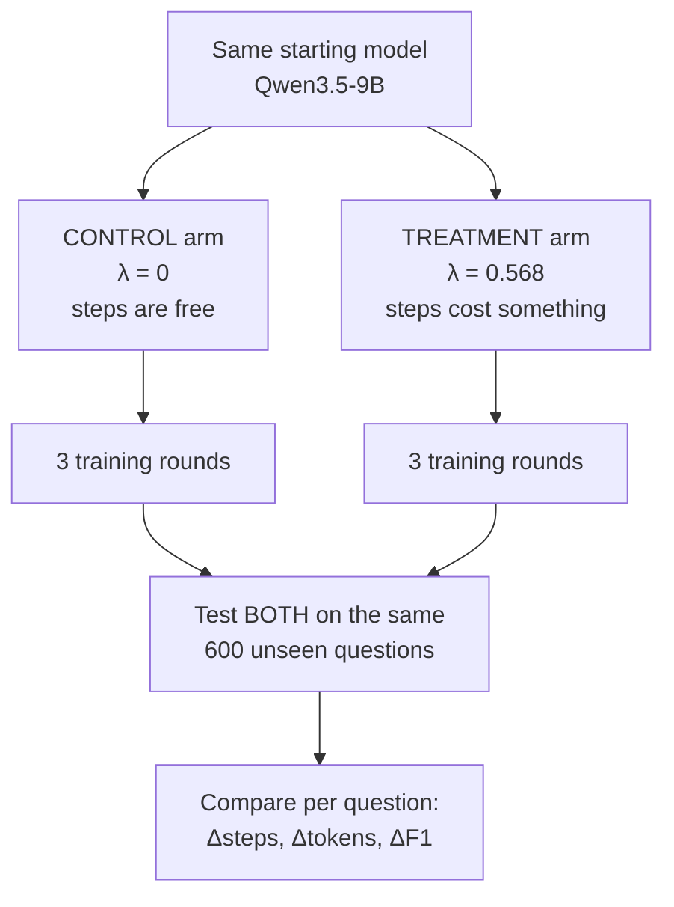
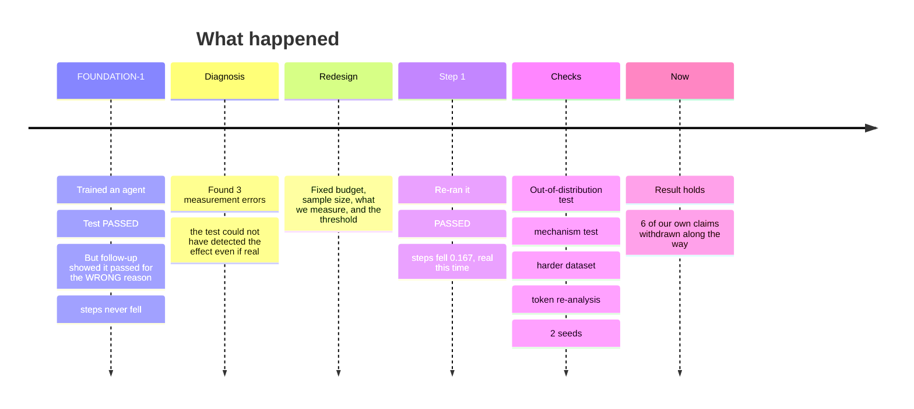
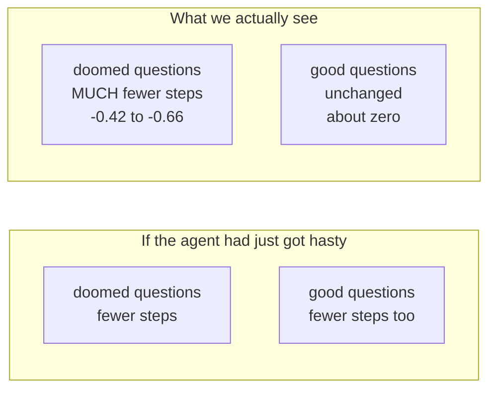

# Teaching an AI agent to stop wasting effort — the complete report

**Everything we did, what we found, what we got wrong, and what it means.**
Written 2026-08-06. Assumes no prior knowledge of this project or of AI research.

---

## How to read this

- **Sections 1–3** explain the problem and the vocabulary. Read these first.
- **Sections 4–7** are what we did and what we found, in order.
- **Sections 8–11** are the results, the mistakes, and what it all means.
- **Sections 12–14** are limitations and next steps.

Every number here was re-read from the raw data files on 2026-08-06, not recalled.
Where a claim was later withdrawn, it is marked and explained rather than deleted.

---

## 1. The problem, in plain words

When an AI agent answers a question, it works in **steps**. Each step it thinks,
searches for information, reads the result, and decides whether to continue.

The problem: **agents don't know when to give up.** A human researcher who has hit
three dead ends will say "I can't find this" and move on. An agent keeps
searching, because nothing ever taught it that its own time costs anything.

That waste is expensive. In our data, about **half of everything the agent spends
goes to questions it never manages to answer.**

**Our question:** can we train an agent to recognise a dead end and stop — using
nothing more than a small penalty for each step it takes?

---

## 2. Vocabulary — every term explained

| Term | What it means |
|---|---|
| **Agent** | An AI that works in a loop: think → search → read → repeat, until it answers. |
| **Step** | One trip round that loop. Our agents take about 3 steps per question. |
| **Token** | The unit AI systems actually charge for — roughly ¾ of a word. A step costs hundreds to thousands of tokens. |
| **Budget (B)** | The number of steps we tell the agent it's allowed. We used B=2, 3 and 4. |
| **λ (lambda)** | The size of the penalty per step. λ=0 means steps are free; λ=0.568 was our trained value. **This is the only thing that differs between our two arms.** |
| **Arm** | One version of the experiment. We always compare a **control** (λ=0, steps free) against a **treatment** (λ=0.568, steps cost something). |
| **F1** | A 0–1 score for answer correctness. 1.0 = perfect, 0 = completely wrong. |
| **Reinforcement learning (RL)** | Training method where the AI tries things, gets a score, and adjusts to score higher next time. |
| **GRPO** | The specific RL algorithm we use. It generates 8 attempts at each question and pushes the model toward the better ones. |
| **Round** | One full cycle of: generate attempts → score them → update the model. We do 3 rounds. |
| **Paired comparison** | Comparing both arms **on the very same questions**, then looking at the difference per question. Much more sensitive than comparing averages, because it cancels out how hard each question happens to be. |
| **95% confidence interval (CI)** | The range the true value probably sits in. **If the range doesn't include zero, the effect is real rather than luck.** This is the single most important thing to look at in every table below. |
| **Significant / ✱** | Shorthand for "the CI excludes zero". |
| **n** | How many questions a number is based on. Bigger n = more trustworthy. |
| **Pre-registration** | Writing down exactly what you'll measure and what counts as success **before** you look at the data. Stops you moving the goalposts. |
| **Seed** | A random-number setting. Re-running with a different seed checks that a result isn't a fluke. |
| **Held-out / frozen set** | Questions the model never trained on, used only for the final test. |
| **AUC** | A 0.5–1.0 score for how well something predicts. 0.5 = coin flip, 1.0 = perfect. |

---

## 3. How the agent works



Each loop is one **step**. Crucially, **every step re-reads the entire
conversation so far** — so later steps cost far more than early ones. We measured
this: **step 10 costs about 9.7× what step 1 costs.** That fact turns out to
matter a great deal (Section 8.2).

---

## 4. The experiment design



**Everything is identical between the two arms except λ.** Same starting model,
same training questions, same number of rounds, same random seed, same test
questions. So any difference we measure can only come from the price on steps.

This matters more than it sounds. An earlier version of this project compared a
trained model against a differently-trained one and credited the difference to
the method — when part of it was just "more training". The matched control makes
that impossible.

---

## 5. The story, in order



### The first attempt said the opposite

We first ran this in July (called **FOUNDATION-1**). The headline test passed:
the trained agent scored higher than both comparison versions.

But a follow-up experiment showed **the agent wasn't taking fewer steps at all**
— it had just got better at answering. When we swept the step penalty from 0 (free)
all the way to 1.0 (very expensive), the number of steps changed by **0.04** —
essentially nothing. Verdict at the time: **"NOT EFFECTIVE."**

### Then we found out why

Three things were wrong with the *test*, not the method:

1. **The budget never bound.** We gave the agent a budget of 4 steps but it
   naturally stopped at 3.5. Telling someone they can spend £4 when they only
   want to spend £3.50 changes nothing.
2. **Far too few questions.** The test used 50 questions. To detect an effect of
   the size actually available, it needed about **751**. That's roughly **15×
   underpowered** — like trying to weigh a letter on bathroom scales.
3. **We asked for more than was possible.** The test required a saving of 0.5
   steps. We later measured that the maximum achievable saving on that dataset was
   **0.31 steps**. The test was unpassable by construction.

**The method was never the problem. The measurement was.**

---

## 6. What we changed

| | FOUNDATION-1 | The redesign |
|---|---|---|
| Budget tested at | 4 steps — slack for 67% of questions | **2 steps** — binding for 64.8% |
| Number of test questions | 50 | **600** |
| What we measured | average steps | **paired difference per question** |
| Success threshold | 0.5 steps (guessed) | **0.119 steps** (calculated from measured headroom) |
| Penalty size λ | set so the "best" point sat somewhere sensible | set so **giving up is actually worth doing** |

The threshold change deserves a note. Instead of picking a number that sounded
reasonable, we **first measured how much saving was physically available**, then
set the bar at half of that. This one discipline caught both of FOUNDATION-1's
failures and one of our own.

---

## 7. Every experiment we ran

### 7.1 Before spending any GPU time — three cheap checks

**S1 — "Can the agent even tell when it's stuck?"**

Our whole idea assumes the agent can recognise a dead end. But *we* only know an
episode is doomed because we hold the correct answer. Could the agent tell without
it?

We trained a small predictor using **only information the agent itself has** — how
confident it sounds, whether its searches are finding relevant pages, whether it's
repeating itself. No peeking at the answer.

| After how many steps | How well it predicts (AUC) |
|---|---|
| 1 step | 0.598 — barely better than a coin flip |
| 2 steps | 0.708 |
| **3 steps** | **0.813** |
| 4 steps | 0.728 |
| 5 steps | 0.694 |

**Result: yes, by step 3 it's quite predictable** (0.813, where 0.5 is chance).
Replicated on two more training runs: 0.815 and 0.798.

The strongest single clue was the model's **own confidence in its last output**.
In plain terms: *the agent already knows when it's lost — it just isn't trained to
act on it.*

The fact that 1 step predicts poorly is reassuring. If a single step had predicted
perfectly, we'd suspect a bug leaking the answer.

**S2 — "How much saving is even possible, and how many questions do we need?"**

Two things came out of this, and both changed the plan:

- Only the **2-step budget actually binds** (64.8% of questions would overspend
  it), versus 25.5% at 3 steps and 17.2% at 4. Our original plan to test at 3
  steps was based on measurements from the *untrained* model, which stops later.
  Corrected.
- Our first choice of what to measure — *total steps wasted on failed questions* —
  turned out to need **2,289 questions** to detect. We had 600. We switched to a
  measure needing **479**, before collecting any data.

**S3 — Writing down the rules before looking**

We committed, in writing and in code: the exact success threshold (0.119 steps),
the quality guard (F1 must not fall by more than 0.02), and the analysis script
itself — all before the training data existed. The script was then run unchanged.

### 7.2 The main experiment (Step 1)

Trained both arms, tested on 600 unseen HotpotQA questions.

| | control (λ=0) | treatment (λ=0.568) | difference | 95% CI |
|---|---|---|---|---|
| Steps used | 2.977 | **2.810** | **−0.167** | [−0.280, −0.057] ✱ |
| Answer quality (F1) | 0.433 | 0.513 | +0.080 | [+0.053, +0.108] ✱ |

**All three pre-registered conditions passed.** The agent used fewer steps, and
the difference was real rather than luck.

### 7.3 Four follow-up checks

We didn't stop there, because a single passing test isn't much evidence.

**Check 1 — where does the extra quality come from?**
The +0.080 quality gain was *not predicted*, which made it suspicious. We split
the results by what the agent did with its steps:

| what the treatment did | how many questions | quality change |
|---|---|---|
| used **fewer** steps | 92 | +0.015 — *not significant* |
| used the **same** steps | 472 | **+0.102** ✱ |
| used **more** steps | 36 | −0.042 — *not significant* |

The quality gain lives where the step count **didn't change at all**. So the
saving and the quality gain are **two separate effects that happen to co-occur.**

**Check 2 — the negative control (SimpleQA)**
We tested both arms on 500 questions from a completely different dataset the model
had **never trained on** — simple single-fact lookups.

- Steps still fell: **−0.228** ✱ — the behaviour transfers to unseen material.
- Quality still rose: **+0.085** — *on questions where there is no efficiency to
  gain.* This confirmed the quality gain is a **side-effect**, not our method
  working.

**Check 3 — a harder dataset (MuSiQue)**
Questions needing 2–4 chained lookups, where the agent fails 54% of the time
(versus 30% on HotpotQA). The effect got **bigger**: −0.242 and −0.292 across two
seeds.

**Check 4 — did we just get lucky? (seeds)**
Re-ran the whole training twice more with different random settings. Two are done
and agree closely (−0.242, −0.292). The third is blocked (Section 13).

---

## 8. The complete results

### 8.1 The headline table

Every row: both arms, same questions, difference measured per question.

| Dataset | n | control steps | treatment steps | **Δsteps** | ΔF1 | fail rate | identical episodes |
|---|---|---|---|---|---|---|---|
| HotpotQA | 600 | 2.977 | 2.810 | **−0.167** | +0.080 | 29.8% | 52.0% |
| SimpleQA *(never trained on)* | 500 | 3.010 | 2.782 | **−0.228** | +0.085 | 52.8% | 65.6% |
| MuSiQue seed 42 | 600 | 3.580 | 3.338 | **−0.242** | −0.005 | 54.0% | 51.3% |
| MuSiQue seed 123 | 600 | 3.630 | 3.338 | **−0.292** | −0.021 | 55.3% | 47.0% |
| **POOLED** | **2300** | | | **−0.232** | | | |

**Pooled 95% CI: [−0.316, −0.148].** Comfortably excludes zero.

Note the last column: **roughly half of all episodes are byte-for-byte identical
between the two arms.** The trained agent is not broadly hastier — it changes its
behaviour on a minority of questions and leaves the rest alone.

### 8.2 In tokens — the number that actually matters

Steps are a convenient unit but nobody is billed for steps. They're billed for
tokens. And because every step re-reads the whole conversation, **the steps the
agent skips are the expensive late ones.**

| Dataset | steps saved | **tokens saved** | how much bigger |
|---|---|---|---|
| HotpotQA | −5.6% | **−13.4%** | 2.4× |
| SimpleQA | −7.6% | **−32.9%** | 4.3× |
| MuSiQue seed 42 | −6.8% | **−20.0%** | 3.0× |
| MuSiQue seed 123 | −8.0% | **−22.4%** | 2.8× |

**The real saving is 13–33% of cost, roughly three times what the step count
suggests.**

Where does it come from? **~91% of it is "prompt" tokens** — context the agent no
longer has to re-read. It isn't writing less; it's having fewer conversations to
re-read.

> **Honest caveat:** token counts vary much more than step counts, so they're
> harder to pin down. Only 2 of the 4 token measurements are individually
> significant, versus 4 of 4 on steps. So **steps stay our primary evidence** and
> tokens are the more meaningful unit — reported together, neither hidden.

### 8.3 The most important finding: it's selective

This is the difference between "learned something useful" and "just got hasty".
We split each dataset by whether the **control** managed to answer:

| Dataset | on questions that were **doomed** | on questions it **answered well** |
|---|---|---|
| HotpotQA | **−0.486** ✱ | −0.031 |
| SimpleQA | **−0.420** ✱ | −0.013 |
| MuSiQue seed 42 | **−0.500** ✱ | +0.062 |
| MuSiQue seed 123 | **−0.663** ✱ | +0.168 ✱ |



**If the penalty had simply made the agent rush, both columns would drop. They
don't — on any dataset.** The cuts land almost entirely on work that was going
nowhere. That saving per doomed question is remarkably stable, **−0.42 to −0.66
across three different datasets.**

### 8.4 What it looks like in practice

**A win** — *"Who is daughter to the third Rebbe of Chabad Lubavitch, named after
his father?"*

```
CONTROL      10 steps, F1 = 0.00
  1. third Rebbe of Chabad Lubavitch
  2. children of Menachem Mendel Schneersohn third Rebbe
  3. daughters of Menachem Mendel Schneersohn third Rebbe
  ...7 more searches...
  → gave no answer at all

TREATMENT     3 steps, F1 = 0.00
  1. third Rebbe of Chabad Lubavitch name
  2. Menachem Mendel Schneersohn daughter named after him
  → "Nechama Dina Schneersohn"
```

The control burned all 10 steps and produced **nothing**. The treatment hit the
same dead end in 3, committed a guess, and stopped. **Seven steps saved, nothing
lost** — neither answer was right.

**The cost** — *"Who's married to the man who produced a documentary about the
singer of 'She's Out of My Life'?"*

```
CONTROL       4 steps, F1 = 1.00
  1. "She's Out of My Life" singer      → Michael Jackson
  2. Michael Jackson documentary producer → David Gest
  3. David Gest wife
  → "Liza Minnelli"                       CORRECT

TREATMENT     3 steps, F1 = 0.00
  1. "She's Out of My Life" singer
  2. Michael Jackson documentary producer
  → "David Gest is married to Lisa Marie Presley."   WRONG
```

**This is what giving up costs.** The treatment had done the hard part — it
correctly identified the producer — then quit one step before the lookup that
would have finished the job.

**How often does each happen?**

| Dataset | quit and lost nothing | quit and lost the answer | ratio |
|---|---|---|---|
| MuSiQue | 44 | **3** | **14.7 : 1** |
| HotpotQA | 12 | **6** | 2 : 1 |

Giving up costs a winnable answer in **0.5%** of MuSiQue questions and **1.0%** of
HotpotQA questions. Real, rare, and worth stating openly.

---

## 9. Six things we claimed and then withdrew

This is the part most reports leave out. Each of these was believed at some point,
written down, and then killed by a later check. Five of the six were our own
over-readings; one was a prediction deliberately written in advance so that it
*could* fail visibly.

| # | What we claimed | Why we withdrew it |
|---|---|---|
| 1 | "The training also improves answer quality" | It's a separate effect. It appears where the step count doesn't change, it appears on single-fact questions where there's no efficiency to gain, and it **disappears entirely** on MuSiQue. |
| 2 | "The penalty acts as a general training improver" | Too strong — no quality gain on MuSiQue at all. |
| 3 | "The penalty protects training from breaking down" | Looked convincing: two control runs degraded badly (to 20.5% and 29.4% malformed output) while the penalised runs stayed healthy. **Then a third run with a different seed had a perfectly healthy control.** It was coincidence. |
| 4 | "The effect is biggest where the budget is tightest" | *Pre-registered in advance, and it failed.* The effect was biggest at a looser budget and appeared at all three. |
| 5 | "The effect scales with how often the agent fails, not with task length" | **A genuine methodological error.** We verified the test's premise using training data, but measured the effect on test data — and on test data the two explanations make identical predictions, so the test couldn't distinguish them. |
| 6 | "The agent reallocates budget to questions it can answer" | The statistics support a small shift, but **zero individual episodes** show "spent more and won". It's a diffuse fraction-of-a-step drift, not a purposeful behaviour. |

**Withdrawal #5 is worth understanding**, because it's a trap that pre-registration
doesn't protect against. Writing down your prediction in advance stops you picking
a hypothesis after seeing results. It does **not** stop you from checking whether
your test can work *using different data from the data you'll measure on*. Check
the premise where you will measure.

**None of these touch the main result.** The step reduction is measured on paired
test data and has now survived: an out-of-distribution dataset, a mechanism test,
a harder dataset, a token re-analysis, manual inspection of individual
trajectories, and two random seeds.

---

## 10. What this means for the paper

### You have two contributions, and the second may be stronger

**Contribution 1 — the empirical finding.** A simple per-step price teaches an
agent to abandon hopeless work. Worth **13–33% of token cost**, selective rather
than indiscriminate, and it transfers to data the model never saw.

**Contribution 2 — how a null result was manufactured by measurement.** Your first
experiment concluded the opposite using the *same method*. You can now show
exactly why: a budget that never bound, 50 questions where 751 were needed, and a
success threshold larger than the maximum achievable effect. Very few papers can
document a reversal that precisely, and the field has a real problem with
under-powered agent experiments.

The six withdrawn claims strengthen rather than weaken this. They show the checks
had teeth.

### What to claim

✅ A per-step cost price teaches cost-aware abandonment
✅ It's selective — it cuts dead ends, not productive work
✅ It transfers to an unseen task distribution
✅ It's worth 13–33% of tokens, ~3× what step counts suggest
✅ Under-powered measurement can manufacture a null result — here's the anatomy

### What NOT to claim

❌ That it improves answer quality (separate, unexplained effect)
❌ That it stabilises training (disproved by seed 123)
❌ Any mechanism for *why* the effect grows on harder data (undetermined)
❌ A three-seed result (until the third lands)

---

## 11. How trustworthy is this?

| Safeguard | What it rules out |
|---|---|
| Success rules written in code **before** data existed, run unchanged | Moving the goalposts |
| Threshold derived from **measured** achievable headroom | Asking for the impossible, or for less than noise |
| Control trained identically, differing **only** in λ | Crediting "more training" to the method |
| Both arms tested on **identical** questions, compared per question | Question difficulty confusing the result |
| Tested on a dataset never trained on | Memorisation |
| Two random seeds | Fluke |
| Test set read **once** | Accidentally tuning to the test |
| Data integrity checks on every training round | Corrupted data producing a fake result |

That last one caught a real problem: a killed-and-restarted job once ran **two
copies of data collection simultaneously**, writing every episode twice. Nothing
downstream would have noticed — it would have completed and produced a plausible
number. It was caught only because a progress counter read higher than physically
possible.

---

## 12. Limitations — stated plainly

1. **The effect is small in absolute terms.** A quarter of a step on 3-step tasks.
   Meaningful as a percentage of cost, modest in absolute size.
2. **One model, one penalty value, three datasets, two seeds.** We haven't shown
   this works for other models or other λ values.
3. **We don't know why the quality side-effect happens.** It isn't better
   searching — the treated agent actually retrieves *fewer* documents.
4. **We don't know why the effect is bigger on harder data.** Two explanations fit
   and we can't separate them (withdrawal #5).
5. **Giving up sometimes costs a right answer** — 0.5–1.0% of questions.
6. **MuSiQue scores are low overall** (~0.27 F1) because our Wikipedia snapshot is
   from 2018 and some questions are newer. This affects both arms equally, so the
   comparison is fair, but absolute scores aren't comparable to published figures.
7. **The health checks during training ran on HotpotQA questions even for MuSiQue
   runs.** Fine for what they check (is the model producing valid output?), but
   their quality scores aren't MuSiQue scores.
8. **One seed outstanding.**

---

## 13. What's still running

**Seed 789** — the third repeat. Another researcher on the shared machine is
currently using all 8 graphics cards for their own work. Our rules forbid
interfering with someone else's job, so we wait.

An automatic watcher checks every 10 minutes and requires the cards to be free on
**two consecutive checks** before starting — a single check can catch the gap
between one job ending and the next loading. It will resume on its own.

**Nothing else is outstanding.** All other experiments are complete, all results
are saved to GitHub and to backup storage.

---

## 14. What to do next

**Immediately (no new experiments needed)**
1. Wait for seed 789 to complete the three-seed set.
2. Write the paper. The result is coherent as it stands.

**To make the result stronger**
3. **A harder benchmark.** The effect grows on harder data. A benchmark where the
   agent fails often *and* runs long would show a much larger saving. Deep-research
   benchmarks like BrowseComp fit.
4. **Settle why it grows.** Build a test set where difficulty and task length vary
   *independently* — e.g. same number of required lookups, different amounts of
   distracting material. This is the clean version of the test that failed.
5. **More λ values.** We tested one. A curve would show whether there's an optimum.

**Worth knowing but lower priority**
6. Explain the quality side-effect.
7. A second model, to show it isn't specific to this one.

**One thing we recommend *not* doing:** the original plan included building a
sophisticated "value model" to replace the simple price. **It isn't needed.** The
simple price works, and the plan called for that machinery only if the simple
approach failed. It didn't.

---

## 15. Where everything is

All work is committed to GitHub and mirrored to backup storage at
`/mnt/src/liangsheng/cassi_foundation/`.

| What | Where |
|---|---|
| This report | `research/COMPLETE_REPORT.md` |
| Technical synthesis | `research/foundation/experiments/reports/T5_SYNTHESIS.md` |
| Individual experiment reports (24) | `research/foundation/experiments/reports/` |
| Figures (5) | `research/foundation/experiments/reports/figs/` |
| Raw results | `research/foundation/experiments/results/` |
| The plan, with wrong sections marked | `research/paper_plan_v2_2_foundation.md` |

**Key reports if you want detail on one thing:**

- Why the first attempt failed → `pre_redesign_diagnostics.md`, `s2_headroom.md`
- Can the agent tell it's stuck → `s1_predictability.md`
- The main result → `s5_verdict.md`
- The quality side-effect → `t1_f1_gain.md`, `t2_negative_control.md`
- The harder dataset → `t4_musique.md`
- Token costs → `u1_token_cost.md`
- The mechanism error → `u2_mechanism_correction.md`
- Example trajectories → `u3_examples.md`

---

## In one paragraph

We trained an AI agent to stop wasting effort by charging it a small penalty for
each step it takes. It works: the agent uses **6–8% fewer steps and 13–33% fewer
tokens**, and — crucially — the savings come almost entirely from questions it was
never going to answer, not from questions it answers well. The behaviour transfers
to data it never trained on and holds across two random seeds. Our own earlier
experiment concluded the opposite, and we can show precisely why: it tested at a
budget the agent never reached, with 50 questions where 751 were needed, against a
target larger than the maximum possible effect. Along the way we withdrew six of
our own claims when later checks contradicted them — including a quality
improvement that turned out to be an unrelated side-effect. What survives is
narrower than we first thought, and much better evidenced.
