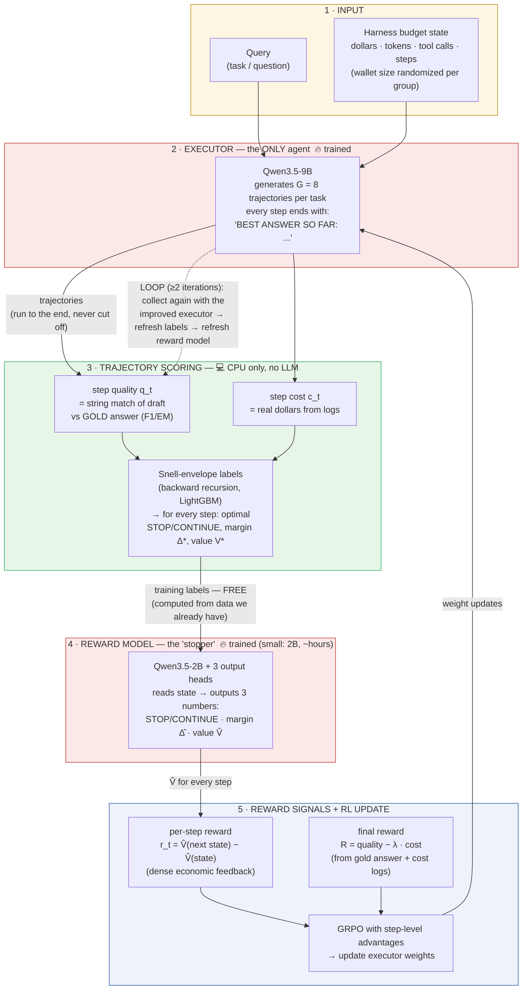
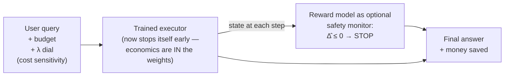

# Proposed RL Plan vs CASSI — Architecture Comparison

> **Purpose of this document:** compare the proposed RL training architecture
> (`proposed_rl_training_architecture.png`) with the CASSI architecture
> (`paper_plan_v2.md`, code in `cassi/`). Written in simple language.
> Every "why" has a paper citation or a code file as proof.

---

## 1. The most important finding first

**The two architectures are the same picture.** Both have:

```
Input (query + budget)  →  Executor generates trajectories  →  Trajectories get scored
→  Reward Model produces reward signals  →  RL algorithm updates the Executor  →  loop
```

There is **only ONE real difference**: what is inside the **Reward Model box**.

| | Proposed plan | CASSI |
|---|---|---|
| Reward Model | Qwen 30B, **frozen**, prompted ("please score this trajectory") | Qwen3.5-2B, **trained** for a few hours on labels computed from gold answers |
| Where its judgment comes from | The 30B model's **opinion** | **Measured facts**: gold answer string-match + real logged dollar costs |

**Important correction of a misunderstanding:** CASSI does **not** train two
agents. The word "monitor" in the old plan was a bad name. The so-called
"monitor" is not an agent at all — it never acts, never calls tools, never
generates trajectories. It reads a state and outputs three numbers. That is
the definition of a **reward model**. The code proves this:
`cassi/stopper/model.py` is an encoder backbone plus **three linear layers**
(no generation loop), and during RL training its output is written into verl's
`rm_scores` tensor — verl's own name for "**r**eward **m**odel scores"
(`cassi/executor/train_grpo.py`).

So the correct question is not *"do we need a second agent?"* (there is no
second agent). The correct question is:

> **How should the Reward Model box be built — a frozen prompted 30B, or a small 2B trained on measured labels?**

---

## 2. Direct answer: is the CASSI diagram the same as the proposed PNG?

**Short answer: the skeleton is identical — same boxes, same arrows, same loop.
But the difference is more than the model names.** Here is the honest checklist:

**Identical (same box, same job):**
- Input = query + budget constraints (dollars, tokens, tool calls, steps) ✅
- One executor generating N trajectories per query ✅
- Step-level evaluation (correctness, quality, budget spent) ✅
- A Reward Model box that turns trajectories into reward signals ✅
- Multiple reward signals (correctness, efficiency, budget, format) ✅
- RL algorithm updates the executor; feedback loop repeats ✅

**Different (one box's construction + details the PNG does not draw):**
1. **Inside the Reward Model box** — trained 2B on measured labels vs frozen
   prompted 30B. This is the one real disagreement (Section 4).
2. **Where the scores come from** — CASSI's correctness/quality numbers are
   computed from the gold answer by string matching (exact, free), not asked
   from an LLM.
3. **Details the PNG does not show but CASSI needs** (these are refinements,
   not contradictions):
   - during label collection the trajectory **always runs to the end** (even
     after the model answers) so every step's future is observable;
   - the **budget wallet is randomized** per task group, so budget-awareness
     gets learned into the weights;
   - a **λ dial** (cost-sensitivity knob) is part of the reward model's input,
     so one model covers the whole cheap↔thorough range;
   - RL credit is assigned **per step**, not per whole trajectory (required by
     the math — see `cassi/executor/shaping.py`);
   - the loop refreshes the reward model each iteration (anti-hacking).

So: **~85% the same drawing.** The proposed PNG is a correct high-level picture
of CASSI if you (a) replace the 30B prompted judge with the trained 2B, and
(b) accept the small training details above.

---

## 3. Box-by-box mapping (proposed diagram → CASSI)

| Box in the proposed diagram | CASSI component | Same? | Code proof |
|---|---|---|---|
| **1. Input**: Query + Harness (dollar / token / tool-call / step budget) | Task + budget features `x_t` (tokens, dollars, tool calls, % of wallet remaining, burn rate) | ✅ Same — CASSI even **randomizes the wallet size** during collection | `cassi/stopper/features.py`, `cassi/executor/collect.py` |
| **2. Executor** (Qwen 3 7B) generates N outputs per query | Executor (Qwen3.5-9B) generates G=8 trajectories per task with GRPO | ✅ Same idea, newer model (avoids the "outdated backbone" review problem) | `cassi/executor/react_agent.py` |
| **3. Trajectory Collection & Evaluation**: step-level correctness, quality, budget spent | Per-step draft scoring vs gold answer + per-step dollar cost + Snell labels | ✅ Same box. The part marked *"I don't know how to calculate this"* is exactly what the **Snell-envelope labels** compute — full walkthrough in Section 5 | `cassi/labels/quality.py`, `cassi/labels/snell.py` |
| **4. Reward Model** (vLLM Qwen 30B, prompted) | **Stopper** = small trained reward model (Qwen3.5-2B, 3 output heads) | ⚠️ **THE ONLY DIFFERENCE** — see Section 4 | `cassi/stopper/model.py`, `cassi/stopper/train_sft.py` |
| **5. Reward Signals** (correctness, efficiency, budget, format) | Final reward = quality − λ·cost **+** per-step reward from the reward model's value **+** format term — full list in Section 6 | ✅ Same list — but correctness and cost come from **ground truth and arithmetic**, not from a model's opinion | `cassi/executor/shaping.py`, `cassi/budget/cost.py` |
| **6. RL Training Methods** (PPO / GRPO / ...) | GRPO with step-level advantages (algorithm comparison kept as an ablation, run on a small pilot first) | ✅ Same | `cassi/executor/train_grpo.py` |
| **Feedback loop** | Collect → recompute labels → refresh reward model → retrain executor (≥2 iterations) | ✅ Same | plan §2.7, runbook P7 |

---

## 4. The one difference, explained slowly

### 4.1 What each Reward Model actually does

Both reward models answer the same question for every step of a trajectory:

> *"How good is the agent's situation right now, considering what was spent?"*

- **Proposed plan:** ask a frozen 30B model this question with a prompt, and
  trust its answer.
- **CASSI:** compute the true answer for the training data (we HAVE the gold
  answer at training time, so quality = a free string comparison; cost = real
  logged dollars), then train a small 2B model to predict these values.
  A few hours of training on 2 GPUs.

### 4.2 Why not the prompted 30B judge? Three evidence-backed reasons

**Reason 1 — LLM judges measurably fail at exactly this question.**
"Was this agent step worth its cost?" is a judgment task that has been
benchmarked: on **RedundancyBench** (arXiv 2605.29893, 2026), the best LLM
methods detect redundant agent steps at only **≈25% step-level F1** — some
below random. Also, GPT-4 used as a stopping judge leaves a large gap to the
oracle under matched budgets (*Reasoning in Token Economies*, arXiv 2406.06461,
EMNLP'24). Prompted judges are fine for fuzzy qualities (helpfulness, tone —
this is standard RLAIF). They are **bad at economic judgment**, which is our
whole topic.

**Reason 2 — a weak judge gets hacked when used as a training reward.**
In RL, the executor is optimized *against* the reward model for thousands of
gradient steps, and RL is very good at finding the judge's blind spots. The
executor learns to **look** efficient instead of **being** efficient. This
failure is measured: reward-model over-optimization (Gao et al., arXiv
2210.10760); AgentPRM saw true success fall **82% → 70%** while the reward
model's score kept rising (arXiv 2502.10325).

**Reason 3 — the judge is not even needed for what it could do.**
At training time we have the gold answer. Correctness = exact string
comparison (free, exact, cannot be hacked — `cassi/labels/quality.py` is ~50
lines of string matching). Cost = addition of logged prices. The 30B judge
would add **noise** to signals we can compute **exactly** — and add real GPU
cost, because it must score every rollout of every training step.

### 4.3 Why the trained 2B is the standard, conservative choice

Classic RLHF (the method behind ChatGPT) is literally: **first train a reward
model on data, then run RL against it** (InstructGPT, arXiv 2203.02155). CASSI
follows this exact recipe. The prompted-judge shortcut (RLAIF, arXiv
2309.00267) is the newer variant, accepted mainly for subjective qualities
that LLMs judge well. So CASSI is not the exotic option — it is the textbook
option. And serving a 2B on every step of every rollout is much cheaper than
serving a 30B.

### 4.4 Why this box is also the paper's novelty — the three competitor papers explained

Five independent novelty audits found that **"one executor + cost adjustment in
the RL reward" is already published territory.** Here are the three key papers
in detail (all read at PDF level for our literature review —
`lit_review/04_budget_cost_aware_agents.md`), so it is clear exactly what
exists and what does not.

#### Paper 1 — OTC-PO: *"Acting Less is Reasoning More"* (arXiv 2504.14870; CUHK + UIUC + Princeton, 2025)

| | |
|---|---|
| **Problem they solve** | RL training on final correctness only (Search-R1 style) makes agents call tools far too often — "cognitive offloading": the model searches instead of thinking. |
| **What they propose** | Multiply the correctness reward by a **tool-efficiency coefficient**. The "optimal" number of tool calls is estimated as the **minimum calls among the correct trajectories in each GRPO group**. Two variants: OTC-PPO and OTC-GRPO. New metric: *tool productivity* = correct answers per tool call. |
| **Results** | Up to **68.3% fewer tool calls**, up to **+215% tool productivity**, with comparable accuracy (Qwen2.5-3B/7B on NQ + HotpotQA — the same data we use). |
| **Weaknesses (their own limits)** | Cost = raw **tool-call count only** — no dollars, no tokens, no fee differences between tools. Reward is **trajectory-level** (one number at the end; no per-step credit). No stopping model, no budget state, no way to control the trade-off at inference. Short-horizon QA only. |
| **What they leave open (our gap)** | A **state-dependent** signal: "is the NEXT step worth its price, given what was already spent?" — their reward cannot express this. |

#### Paper 2 — EAPO: *"Learning When Not to Act"* (arXiv 2606.02132; CAS + ByteDance + Zhejiang, 2026)

| | |
|---|---|
| **Problem they solve** | Uniform tool penalties (OTC-style) hurt **hard** questions — a flat penalty stops the agent from exploring exactly when exploration is needed. The right target is *unnecessary* tool use only. |
| **What they propose** | (1) Force a few **tool-free rollouts** in each GRPO group, so training sees direct evidence of whether internal reasoning is enough; (2) **difficulty-adaptive penalty**: difficulty = the group's failure rate; easy queries get penalized hard for tool use, hard queries barely; (3) confidence-aware token reweighting. |
| **Results** | vs plain GRPO: **+7–10% average performance** while **cutting tool calls 18–25%** (Qwen2.5-3B/7B, Llama3.1-8B; math + multi-hop QA incl. HotpotQA, MuSiQue, Bamboogle). |
| **Weaknesses** | Difficulty is a **group statistic** (needs G rollouts of the same query — only works during training, not at inference). Still **outcome-level** reward; still tool-count only; no budget state; no stopping model; horizons of only a few calls. |
| **What they leave open (our gap)** | Their adaptivity is per-*query* (from group statistics). Nothing adapts per-*step* to the actual state and the remaining wallet. |

#### Paper 3 — SlimSearcher: *"Adaptive Reward Gating"* (arXiv 2606.07074; Zhejiang + Ant Group, 2026)

| | |
|---|---|
| **Problem they solve** | Deep-research agents suffer "**efficiency collapse**": accuracy-only RL scales UP search rounds to force correctness — blind tool dependency, redundant loops. |
| **What they propose** | Target the "Minimal Necessary Path": (1) SFT on Pareto-filtered trajectories (keep the correct AND cheap ones); (2) GRPO with **multiplicative cascading gates**: R = correctness-gate × tool-cost-gate × length-gate, each anchored to the **group's empirical minimum** (adaptive, not a fixed penalty). |
| **Results** | Tool-call rounds **−17% to −58%** at equal or better accuracy on GAIA / BrowseComp / XBench / HLE (30B backbones, 64 H800 GPUs). Example: GAIA rounds 20.6 → 10.6 with accuracy 0.682 → 0.709. A prompt-only baseline failed to improve efficiency. |
| **Weaknesses** | Still **outcome-level** (one gated number per trajectory). The anchor is group-relative (needs rollouts of the same query; unusable at inference). No dollar costs (uniform tool weights); no budget state or λ; no per-step signal; no inference-time controller. |
| **What they leave open (our gap)** | Everything per-step and everything budget-conditioned. |

#### What the three papers have in common — and the surviving gap

All three follow the **same recipe**: one executor, and a cost adjustment
applied to the **final trajectory-level reward**. That recipe is exactly the
proposed plan with the Reward Model box removed or made generic. It works —
and it is **taken** (published, with strong numbers, on our exact datasets and
benchmarks).

What **no paper** does (checked across 10 literature areas, ~94 papers):

1. compute, for **every step**, the honest value of stopping-now vs continuing
   (quality − λ·cost, by backward recursion — Section 5);
2. train a **small value model** on those labels;
3. use that model's value as a **dense per-step training reward** for the
   executor;
4. then show the economics moved **into the executor's weights**
   (it stops itself even with the monitor off).

Delete the trained reward model, and the paper becomes "OTC-PO with a
different reward" — which the audits scored as a likely rejection. Keep it,
and every one of the three papers above becomes a baseline we beat or an
ablation arm (OTC-GRPO = baseline B4, EAPO = baseline B5, group-relative
gating = the B6 family).

### 4.5 "Why a small 2B? Why not train the 30B — it is a better model, and SFT on 2B might not improve much"

A fair question. Four answers, from principle to practice:

**(a) The task is small, so the model can be small.** The reward model does not
generate anything — it reads a short feature block and outputs **three
numbers**. The intelligence lives in the **labels** (gold answers + real
costs, computed exactly), not in the model. The 2B only learns to map
features → values. "30B is a better model" is true for knowledge and
generation — neither is needed here.

**(b) "SFT might not improve much" compares the wrong things.** We are not
making a 2B "a bit better." The base model — 2B *or* 30B — has **zero**
ability to output Δ̂ and V̂: those output heads do not exist until training
creates them. SFT builds the capability from nothing. The only real question
is "can a 2B learn this mapping well enough?" — and that is tested, not
assumed: gate **P4** requires the trained stopper to beat majority-class and a
calibrated confidence probe on held-out stopping regret, **or we stop and fix
before any RL**. Ablation **A1** tests 0.8B / 2B / 4B sizes. If 2B is too
small, we scale up; nothing in the architecture breaks.

**(c) Small reward model + big policy is the standard, not the exception.**
InstructGPT (the ChatGPT recipe, arXiv 2203.02155) used a **6B reward model to
train a 175B policy** — ~30× smaller. The trained-stopper literature
(TERMINATOR, OS-Pruner, LYNX) and agent PRMs (~3B) all use small models over
big policies. A reward model **bigger than the policy** (30B over 9B) would be
the unusual design.

**(d) The decisive point for THIS paper: a 30B reward model fails our own
cost accounting.** The reward model is called on **every step of every
rollout** — millions of calls in training, every step at inference in monitor
mode. A 30B watcher costs ~3× more than the 9B agent it supervises. Table T4
(end-to-end overhead, the first thing reviewers of a cost paper check) would
show the cost-saving method spending more on supervision than it saves — the
paper would refute itself. LearnStop (arXiv 2606.30852) documents exactly
this: monitor overhead can flip the sign of the savings. Also practical: the
existing 30B runs on a vLLM **inference** server — vLLM cannot train; SFT-ing
a 30B MoE needs its own multi-GPU training allocation.

**The compromise that settles it with data:** (1) run P4 as designed — if the
2B fails the gate, scale to 4B (A1) before debating further; (2) add the
**prompted 30B as a baseline arm** using the existing vLLM server (zero
training cost), so the tables directly show trained-2B vs prompted-30B.
Whichever wins, the paper wants that number.

### 4.6 If we are still unsure — we do not have to argue; we run the test

The codebase already contains the "no trained reward model" versions:
**B9** (`cassi/baselines/b9_direct_shaping.py` — labels feed rewards directly,
no stopper) and **B6** (`cassi/baselines/b6_single_model_cost.py` — cost in
the outcome reward only, ≈ the proposed plan's spirit). **Kill-switch K1**
(weeks 2–3, 1K tasks, `cassi/scripts/killswitch_decision.py`) runs CASSI
against them. If the trained reward model does not earn its place, the plan
has a pre-registered pivot. The disagreement is settled **by data, cheaply,
before any big investment**.

---

## 5. How a trajectory is made, and how the labels are calculated

This section answers the note in the proposed plan: *"Each trajectory will
have the calculation … if in Step N, the llm has answer the correct answer by
how close. (i dont know how to calculate this)"*. Here is exactly how.

### 5.1 Making one trajectory (collection mode)

1. Pick a task, e.g. *"Which country was the author of novel X born in?"*
   (gold answer: **Ireland** — known at training time only).
2. Draw a **wallet** for this task group (small / medium / large — randomized
   so the model later learns to react to budgets).
3. The executor runs the ReAct loop: *think → tool call → observe → repeat*.
   **Rule of the template:** every step must end with one line:
   `BEST ANSWER SO FAR: ...` (or `EMPTY_DRAFT`). This line is the executor's
   current draft answer.
4. **Forced continuation:** even if the executor says "final answer" at step 3,
   we log that flag and keep it running to the maximum step count (T_max = 10
   for QA). Why: we need to SEE what would have happened after every step —
   otherwise the future of late steps is invisible and the labels are biased.
   (Code: `cassi/executor/collect.py`.)
5. We do this **G = 8 times per task**, for ~8–10K tasks. Every step of every
   trajectory is logged with its features `x_t` (budget state, step number,
   history digest, the draft) and its **dollar cost** (tokens priced + tool
   fees — `cassi/budget/cost.py`).

### 5.2 Scoring each step (free, no LLM)

For each step `t` we compute two numbers:

- **Quality `q_t`** = F1/EM string match of the step-t draft vs the gold
  answer (`cassi/labels/quality.py`). Free — the draft is already in the log.
  (On ALFWorld: fraction of subgoals done, read from the environment.)
- **Stopping utility `U_t` = q_t − λ · C_t** — "how good is stopping HERE":
  the quality you walk away with, minus the (normalized) money spent so far,
  weighted by the cost-sensitivity λ.

### 5.3 Worked example (one trajectory, λ = 1)

| step t | what happened | draft | q_t | money spent C_t | **U_t = q_t − C_t** |
|---|---|---|---|---|---|
| 1 | search for novel X | EMPTY_DRAFT | 0.00 | 0.02 | **−0.02** |
| 2 | read search result | "John Banville" (wrong) | 0.00 | 0.05 | **−0.05** |
| 3 | search author's birthplace | "Ireland" ✅ | 1.00 | 0.08 | **0.92** |
| 4 | verification search (unneeded) | "Ireland" | 1.00 | 0.12 | **0.88** |
| 5 | another search (pure waste) | "Ireland" | 1.00 | 0.16 | **0.84** |

You can already SEE the answer: the best moment to stop is **step 3**
(U = 0.92). Steps 4–5 only burn money. Now the calculation that finds this
automatically, for every trajectory:

### 5.4 The backward recursion (Snell envelope — `cassi/labels/snell.py`)

Walk **backwards** from the last step and ask at each step: *"is stopping now
better than what the future is expected to bring?"*

```
V_5 = U_5 = 0.84                                (last step: must stop)
t=4: Cont = expected V_5 given state x_4 ≈ 0.84   → U_4 = 0.88 > 0.84 ⇒ STOP is better;  V_4 = 0.88
t=3: Cont = expected V_4 given state x_3 ≈ 0.88   → U_3 = 0.92 > 0.88 ⇒ STOP is better;  V_3 = 0.92
t=2: Cont = expected V_3 given state x_2 ≈ 0.92   → U_2 = −0.05 < 0.92 ⇒ CONTINUE;       V_2 = 0.92
t=1: Cont ≈ 0.92                                  → U_1 = −0.02 < 0.92 ⇒ CONTINUE;       V_1 = 0.92
```

Result labels for every step:
- **a\*** = CONTINUE, CONTINUE, **STOP**, STOP, STOP  → optimal stop τ\* = 3
- **Δ\*** = Cont − U (the margin: how much is continuing still worth?):
  +0.94, +0.97, **−0.04**, −0.04, … (positive = keep going, ≤ 0 = stop)
- **V\*** = the value of each state: 0.92, 0.92, 0.92, 0.88, 0.84

**One important detail:** "expected V of the next step" is NOT read from this
one trajectory — it is a small regression (LightGBM) fit **across all 8
rollouts of many tasks at once**. Why: one single trajectory's future can be
lucky or unlucky. If we just took the best future of the same run, we would be
training the model to predict what a fortune-teller would do (this bias is
called the *prophet bias* in optimal-stopping theory). The regression gives
"what usually happens next from states like this one" — which is what a real
decision-maker actually faces. This is the Longstaff–Schwartz method banks use
to price options (Longstaff & Schwartz 2001), moved to agent trajectories.

Total cost of all this: **zero extra LLM calls.** String compares + one small
LightGBM fit per step index. Runs on CPU.

---

## 6. The reward signals, and the 2B reward model's exact input/output

### 6.1 What the 2B reward model receives (input)

One serialized text block per step — the SAME format at training and at
inference (template: plan §18.1; code: `cassi/stopper/features.py`):

```
<stopper_input>
[TASK] Which country was the author of novel X born in?
[BUDGET] tokens 3410/8192 (41%) | tool calls 4/20 | $0.081/$0.20
         | tier MEDIUM | burn $0.020/step
[OBJECTIVE] cost-sensitivity λ = 1.0        ← the user's dial
[PROGRESS] step 4/10 | draft unchanged for 1 step
           | draft edit-distance (last 3): 12,0,0
           | retrieval overlap (last 3): 85% | distinct sources: 3
[HISTORY] 2: search: "novel X author ..."
          3: search: "John Banville birthplace ..."
          4: search: "verify Ireland ..."
[DRAFT] Ireland
</stopper_input>
```

Note what is **deliberately NOT in the input**: any gold-answer information,
and any confidence statement written by the executor (both are banned to
prevent cheating — plan §2.1, §11).

### 6.2 What the 2B reward model outputs (three numbers)

| Head | Output | Trained on (from Section 5) | Used for |
|---|---|---|---|
| action | STOP / CONTINUE logit | a\* | sanity checks, evaluation |
| **Δ̂** | margin in [−1, 1] | Δ\* | **inference-time stopping**: Δ̂ ≤ 0 → stop the agent |
| **V̂** | value of this state | V\* | **the RL training reward** (below) |

(Code: `cassi/stopper/model.py` — three linear heads on the last token's
hidden state.)

### 6.3 The full list of reward signals in RL training

Mapped to the proposed plan's "Reward Signals" box:

| Proposed plan's signal | CASSI's version | Computed from |
|---|---|---|
| Correctness reward | terminal quality Q (EM/F1 of final answer) | gold answer, string match |
| Budget / Efficiency reward | − λ · (tier-weighted dollar cost) | logged prices, arithmetic |
| **NEW: dense per-step reward** | r_t = V̂(next state) − V̂(this state) | the 2B reward model |
| Format reward | small bonus for following the template | regex check |
| Helpfulness / Safety | not needed for QA/ALFWorld (correctness already covers it) | — |

The terminal reward is `R_base = Q − λ·cost` — note it is the **same formula
as the labels' U**, so the executor, the reward model, and the labels all
optimize ONE objective, not three different ones.

The per-step line is the paper's core trick: `V̂(next) − V̂(this)` pays each
step exactly its **marginal contribution** — a step that moves the state
toward "stop-worthy with high utility" earns positive reward; a wasteful step
past the optimal point earns negative reward automatically. And because this
is *potential-based shaping* (Ng, Harada & Russell 1999), it provably does not
change what the optimal policy is — it only makes the sparse end-signal dense.
(Code: `cassi/executor/shaping.py`, with the telescoping property asserted in
`cassi/tests/test_core.py`.)

---

## 7. What is adopted FROM the proposed plan

The proposed plan is right about several things, and these are kept:

1. **The vocabulary.** "Executor + Reward Model + RL loop" describes the
   system better than the old "monitor agent" wording.
2. **Validate the pipeline with the simplest budget first** (step budget) —
   matches runbook P0's done-criterion.
3. **A small RL-algorithm pilot** (~100 tasks) to check the plumbing and
   eliminate any algorithm that visibly collapses — as an **ablation**, with
   GRPO as the default (100 tasks is too few to *prove* a winner; differences
   at that scale are within seed noise).
4. **The greedy idea** as a second angle: the stopping margin Δ ("is one more
   step worth its price?") IS a greedy local decision, and classical theory
   says greedy index rules are provably optimal for this problem class
   (Weitzman's Pandora's Box, 1979; Russell & Wefald metareasoning, 1991). A
   literature check (2026-07) found no LLM-agent paper claims this
   index-policy framing — it strengthens the theory section at zero compute
   cost, plus a free analysis: does the trained executor learn adaptive
   tool-call granularity (big expensive calls on hard tasks, small cheap calls
   on easy ones)?

---

## 8. CASSI high-level architecture (diagram)

### 8.1 Training loop



🔥 = weights are trained &nbsp;·&nbsp; 💻 = pure CPU computation, no model at all

### 8.2 Inference (after training — no gold answer needed)



The same small model that produced training rewards can optionally watch the
agent at inference. The paper's key measurement: the trained executor keeps
most of the savings **even with this monitor switched off** — proof that the
economics moved into the executor's weights.

---

## 9. Hardware map — what needs training GPUs, what runs on vLLM, what runs on CPU

| Component | Hardware | Type | Notes |
|---|---|---|---|
| **Executor GRPO training** (also trained baselines B4–B9) | **4–8 training GPUs** (verl) | 🔥 TRAIN | The big cost of the whole project (~1–3 days per run). Weights change → cannot be a frozen vLLM server. |
| **Reward model (stopper) SFT** | **2 training GPUs, a few hours** | 🔥 TRAIN | Cheapest training item in the plan (2B model, 3 epochs). |
| **Trajectory collection** (rollouts for labels) | vLLM inference | ❄️ FROZEN | Generation only — a frozen snapshot of the current executor. Can run on a separate inference server. |
| **Quality scoring + Snell labels** | **CPU only** | 💻 CPU | String comparison + LightGBM. No GPU, no LLM at all. |
| **Reward model serving during RL + eval** | 1 small GPU (2B model) | ❄️ FROZEN (within an iteration) | Frozen while the executor trains; refreshed between iterations. |
| **Training-free baselines B1–B3** | vLLM inference | ❄️ FROZEN | No training at all. |
| **All evaluation runs** | vLLM inference | ❄️ FROZEN | Trained checkpoints served frozen. |

Key point: **the only place a frozen vLLM server cannot help is where weights
must change** — the executor GRPO and the small stopper SFT. Everything else
is inference or CPU.

### 9.1 Where the existing vLLM Qwen 3.5 30B server fits

A ready 30B on vLLM is a useful resource — just not as the training reward
model (Section 4.2). Three good uses inside CASSI, all inference-only:

1. **The frozen strong agent in the transfer evaluation (E2 / GAIA).** The
   plan evaluates the trained 2B reward model as a runtime monitor **on top of
   a strong frozen agent** — exactly the SupervisorAgent (ICLR'26, arXiv
   2510.26585) setup. The 30B server can BE that frozen strong agent. This is
   a headline experiment, and the 30B slots in with zero extra work.
2. **An extra baseline: the prompted 30B judge itself.** Add "prompted 30B as
   stopping monitor" as a variant of baseline B2/B3. Then the
   trained-2B-vs-prompted-30B question is answered **in our own tables with
   data**, instead of only by citation. If RedundancyBench is right, the 30B
   variant loses — and that result directly supports the paper's motivation.
   If it wins, we learn that early and cheaply.
3. **Manual label-quality checks** (runbook P3: review of 100 random
   trajectories) — the 30B can pre-screen trajectories to speed up the human
   review. Convenience only; never a label source.

---

## 10. Summary in three sentences

1. The proposed plan and CASSI are the **same architecture** (Section 2: same
   skeleton, ~85% identical); the only real difference is whether the Reward
   Model box is a **frozen prompted 30B** (measured ~25% accurate at judging
   step redundancy, and hackable under RL) or a **small 2B trained in hours on
   labels computed from gold answers and real costs** (the textbook RLHF
   recipe, cheaper to serve, and the source of the paper's novelty — because
   OTC-PO/EAPO/SlimSearcher already published the no-reward-model version).
2. There is **no second agent** anywhere: the "monitor" is a 3-number scoring
   model, and its optional inference-time role is a bonus that enables the
   paper's key measurement (internalization).
3. If doubt remains, baselines **B6/B9 + kill-switch K1** (already
   implemented) settle the question with data in weeks 2–3, before any large
   spend — and the existing 30B vLLM server gets a real job in the transfer
   evaluation and as an extra baseline.

---

## 11. References

| Claim | Source |
|---|---|
| RL cost penalty via tool-efficiency coefficient; −68.3% tool calls | OTC-PO — arXiv 2504.14870 |
| Difficulty-adaptive tool penalty; +7–10% perf at −18–25% calls | EAPO — arXiv 2606.02132 |
| Adaptive reward gating for deep research; rounds −17–58% | SlimSearcher — arXiv 2606.07074 |
| LLM judges detect redundant agent steps at ≈25% F1 | RedundancyBench — arXiv 2605.29893 |
| GPT-4 as stopping judge leaves large oracle gap | Reasoning in Token Economies — arXiv 2406.06461 (EMNLP'24) |
| Reward-model over-optimization (Goodhart) under RL | Gao et al. — arXiv 2210.10760 |
| True success 82%→70% while frozen reward model's score rose | AgentPRM — arXiv 2502.10325 |
| "Train a reward model, then RL against it" = standard RLHF | InstructGPT — arXiv 2203.02155 |
| Prompted-judge rewards (RLAIF) — for subjective qualities | RLAIF — arXiv 2309.00267 |
| Runtime monitor over frozen agent (comparison target) | SupervisorAgent — arXiv 2510.26585 (ICLR'26) |
| Backward-recursion stopping values (the label math) | Longstaff–Schwartz (2001); Snell envelope; closest LLM precursor Stop-RAG — arXiv 2510.14337 |
| Greedy index rules provably optimal for costly search | Weitzman, *Pandora's Box* (Econometrica 1979); Russell & Wefald (1991) |
| Potential-based shaping preserves the optimal policy | Ng, Harada & Russell (1999); SHAPE — arXiv 2604.06636 (ACL'26) |

Code proof locations (this repo): `cassi/stopper/model.py` (reward model = 3
linear heads, not an agent) · `cassi/stopper/train_sft.py` (2B, 3 epochs) ·
`cassi/labels/quality.py` (quality = string match vs gold) ·
`cassi/labels/snell.py` (labels via LightGBM backward recursion) ·
`cassi/executor/shaping.py` (reward model's V̂ → per-step RL reward) ·
`cassi/executor/train_grpo.py` (V̂ written into verl's `rm_scores` reward-model
tensor) · `cassi/baselines/b6_single_model_cost.py`, `b9_direct_shaping.py`
(the "no trained reward model" arms) · `cassi/scripts/killswitch_decision.py`
(the K1 GO/NO-GO test).
